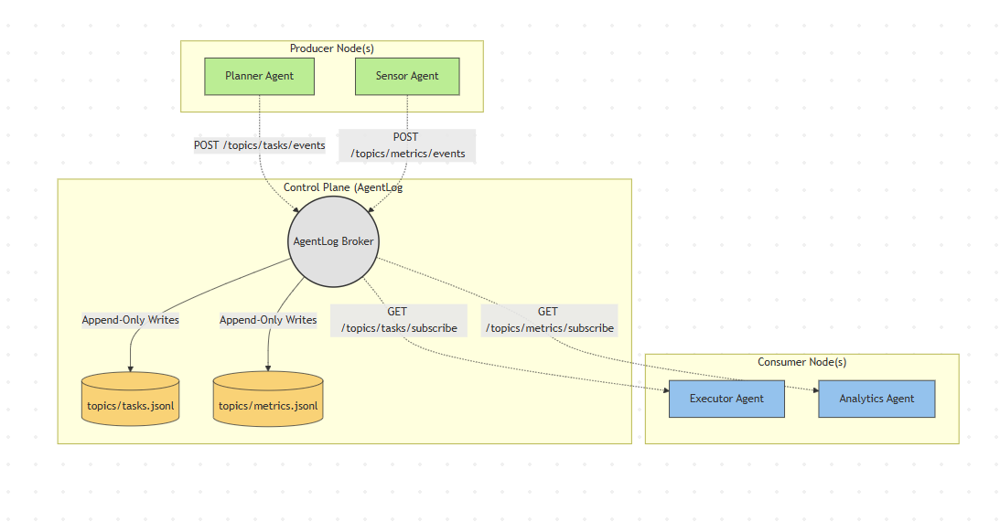

# AgentLog

A simple, lightweight Kafka-like messaging system designed for AI agents, using JSONL append-only logs as the storage format.

## Philosophy

Kafka × `tail -f` × AI agents.
It is lightweight, append-only, and easily inspectable with Unix tools.

## Architecture

- **Topics**: Each topic is stored as a `.jsonl` file.
- **Offsets**: Tracked by consumer groups using `.offset` files.
- **Broker**: Broadcasts incoming events via SSE (Server-Sent Events) for real-time streaming.
- **Replay**: Fetch historical payloads.

## Demo
https://github.com/user-attachments/assets/01afcb6d-2748-400c-9c74-138a40255d70

## Usage

### Server

Run the server:

```bash
go run cmd/server/main.go
```

The server binds to port 8080 and uses `data/topics/` to store event logs.

### CLI

There is a simple CLI provided to interact with the system.

```bash
# Build the CLI tool
go build -o agentlog cmd/cli/main.go

# Tail a topic (Subscribes to live SSE events)
./agentlog tail tasks

# Publish an event to the "tasks" topic
./agentlog publish tasks task_created '{"task": "research transformers"}'

# Replay events from offset 0
./agentlog replay tasks --offset 0
```

### Direct HTTP / Curl access

**1. Create a Topic / Publish an Event**

```bash
curl -X POST \
  http://localhost:8080/topics/tasks/events \
  -H "Content-Type: application/json" \
  -d '{
    "producer": "planner",
    "type": "task_created",
    "payload": {"task": "research kafka"}
  }'
```

**2. Subscribe to a Topic (SSE)**

```bash
curl -N http://localhost:8080/topics/tasks/subscribe
```

**3. Replay Events**

```bash
curl http://localhost:8080/topics/tasks/replay?offset=0
```

### File Inspection

You can view the raw logs using Unix tools:

```bash
cat data/topics/tasks.jsonl
tail -f data/topics/tasks.jsonl
```

## AI Agent Demo (OpenRouter)

This project contains an end-to-end demonstration showcasing how two AI agents can collaborate using `agentlog`. A **Planner Agent** breaks down tasks and publishes them, and an **Executor Agent** consumes them real-time and acts on them.

Both agents leverage OpenRouter API for LLM inference.

### Running the Demo

1. **Start the AgentLog Server**
   ```bash
   go run ./cmd/server/main.go
   ```

2. **Start the Executor Agent (Terminal 2)**
   It will wait and listen continuously on the `tasks` SSE stream.
   ```bash
   # Windows (PowerShell)
   $env:OPENROUTER_API_KEY="your-api-key"
   go run ./examples/demo/executor/main.go

   # Linux/Mac
   OPENROUTER_API_KEY="your-api-key" go run ./examples/demo/executor/main.go
   ```

3. **Start the Planner Agent (Terminal 3)**
   Provide it a high-level goal. It will generate subtasks and publish them.
   ```bash
   # Windows (PowerShell)
   $env:OPENROUTER_API_KEY="your-api-key"
   go run ./examples/demo/planner/main.go "Research how to deploy Kafka"

   # Linux/Mac
   OPENROUTER_API_KEY="your-api-key" go run ./examples/demo/planner/main.go "Research how to deploy Kafka"
   ```

## Future Architecture: Distributed Agent Event Mesh

Currently, `agentlog` is designed to be easily testable on a single machine. The robust long-term vision is to establish it as the **central event broker** and **network-reachable message bus** for an entire ecosystem of decoupled, asynchronous micro-agents.

By exposing the HTTP/SSE endpoints across a real network, `agentlog` facilitates an **event-driven architecture** where autonomous agents can be deployed across distributed infrastructure.

### The Decoupled Topology



In this distributed paradigm:

- **Location Transparency:** Producers and Consumers only need the IP address of the `agentlog` broker. They are agnostic to each other's physical network locations or lifecycles.
- **Topic-Based Pub/Sub Routing:** Agents subscribe only to the semantic event streams they care about, minimizing unnecessary network chatter.
- **Resilience via Deterministic Log Replay:** If an Executor node crashes, it can simply reboot and issue a `GET /topics/tasks/replay?offset=X` to seamlessly rehydrate its state and resume processing with exactly-once guarantees.

## Roadmap

- [ ] CLI tooling
- [ ] Topic retention policies
- [ ] Event schemas
- [ ] Topic compaction
- [ ] Multi-node replication
- [ ] Agent workflow visualization

## Contributing

Contributions are welcome!
Feel free to open issues or submit pull requests.

## License

MIT

## Inspiration

Inspired by:
- Apache Kafka
- Event sourcing architectures
- Unix philosophy: simple tools, composable systems
